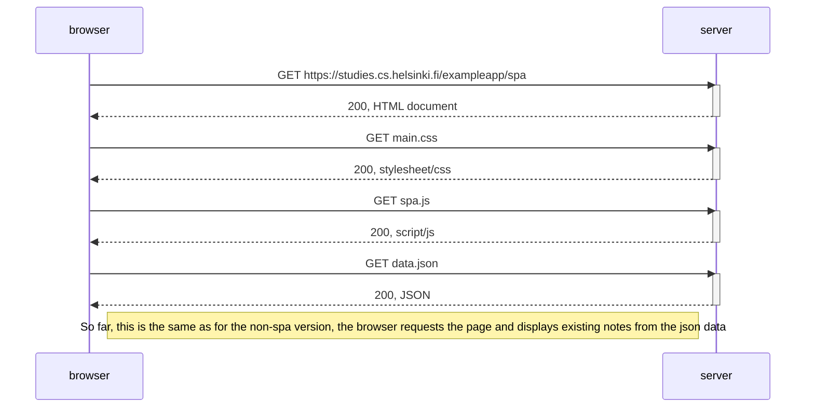

```mermaid
sequenceDiagram
	participant browser
	participant server
browser->>server: GET  https://studies.cs.helsinki.fi/exampleapp/spa
activate server
server-->>browser: 200, HTML document
deactivate server
browser->>server: GET main.css
activate server
server-->>browser: 200, stylesheet/css
deactivate server
browser->>server: GET spa.js
activate server
server-->>browser: 200, script/js
deactivate server
browser->>server: GET data.json
activate server
server-->>browser: 200, JSON
deactivate server
Note right of browser: So far, this is the same as for the non-spa version, the browser requests the page and displays existing notes from the json data
```
