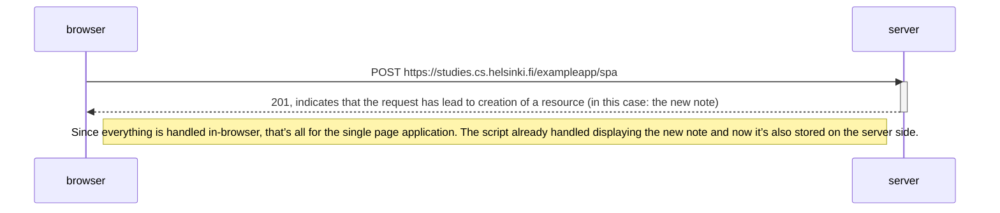

```mermaid
sequenceDiagram
	participant browser
	participant server
browser->>server: POST  https://studies.cs.helsinki.fi/exampleapp/spa
activate server
server-->>browser: 201, indicates that the request has lead to creation of a resource (in this case: the new note)
deactivate server
Note right of browser: Since everything is handled in-browser, that’s all for the single page application. The script already handled displaying the new note and now it’s also stored on the server side.
```
